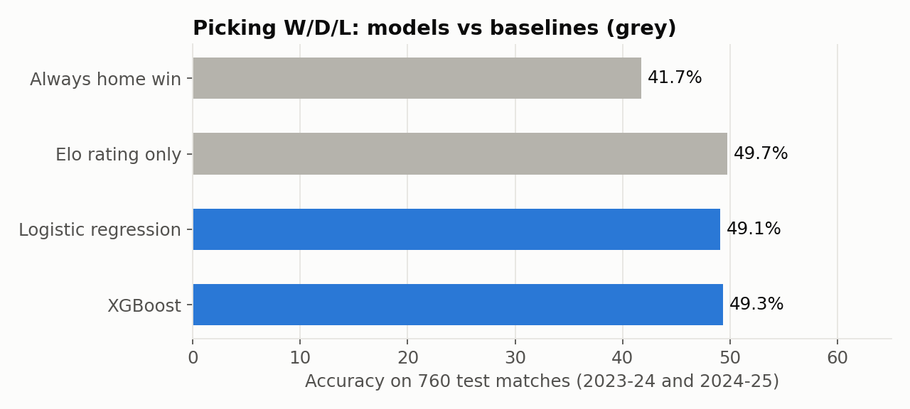
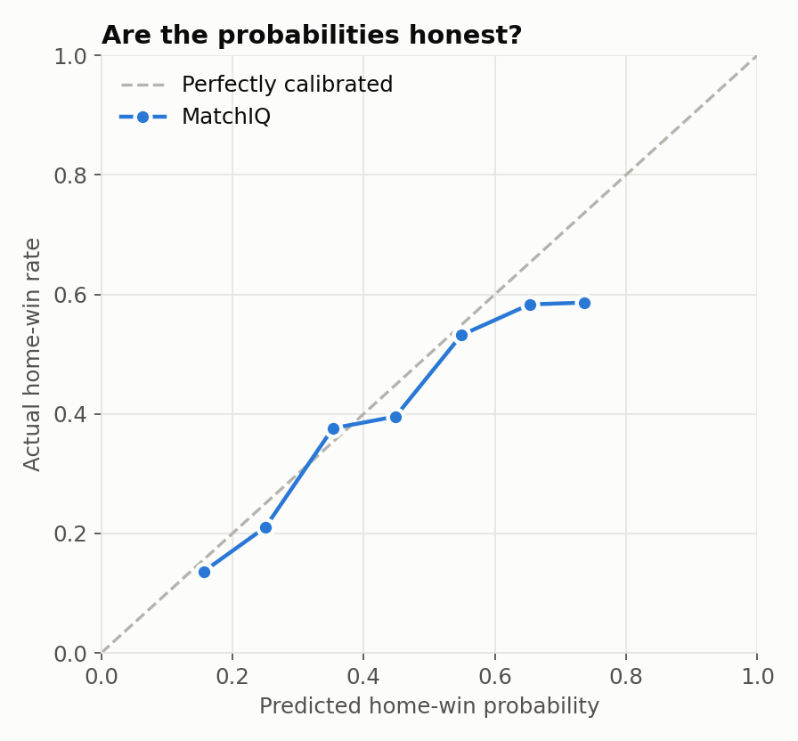
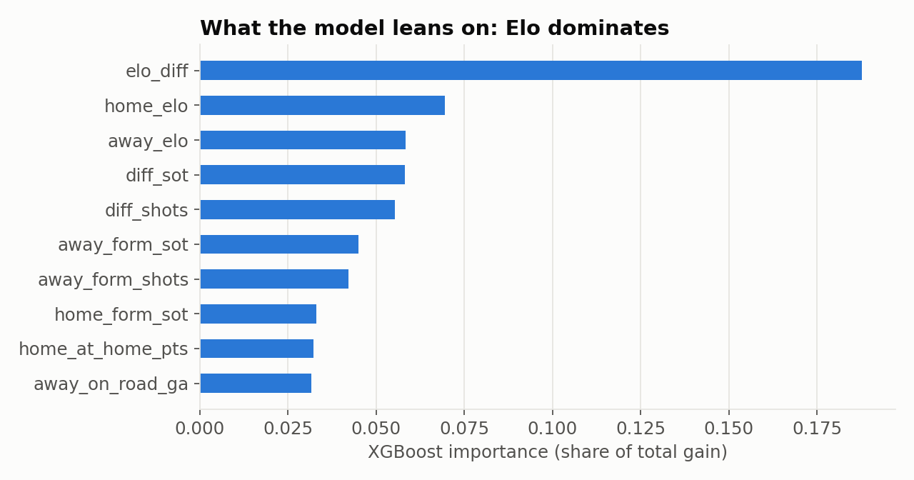

# MatchIQ

AI football analytics for the Premier League. MatchIQ predicts this season's matches and finds players with similar playing styles.

**▶ Live demo: [matchiq-ibrahim.streamlit.app](https://matchiq-ibrahim.streamlit.app)**

| Module | What it does | Status |
|---|---|---|
| **Match Predictor** | Win / draw / loss probabilities for any 2026-27 fixture, plus the next gameweek | ✅ Done |
| **Player Scout** | "Find players like Saka": similarity search, scouting reports, playing-style clusters | ✅ Done |
| **Ask MatchIQ** | Chatbot that answers questions using the predictor and the scout | 🔜 Planned |

---

## Match Predictor

### Results

Trained on 3,420 matches (2015-16 to 2023-24) and tested on all 760 matches of 2024-25 and 2025-26, which the model never saw. The model was chosen on a separate validation season (2023-24) before the test seasons were scored.



| Model | Accuracy | Log loss (lower is better) |
|---|---|---|
| Always pick the home team (baseline) | 41.7% | 1.083 |
| **Elo rating only (chosen model)** | **49.7%** | **1.008** |
| Logistic regression, 24 features | 49.1% | 1.014 |
| XGBoost, 24 features | 49.3% | 1.027 |

**What I found**

- **The model beats the home-team baseline by 8 points** (49.7% vs 41.7%) on two unseen seasons.
- **Elo ratings carry almost all of the signal.** Adding 23 form features (recent points, goals, shots, shots on target, home/away splits) didn't improve validation or test log loss, so the app uses Elo alone. That matches published football models: a good team-strength rating is hard to beat with box-score stats.
- **The probabilities are well calibrated.** When the model gives a home side a 60% chance, home sides in that bucket win close to 60% of the time:



- **The test seasons were unusually hard.** Home teams won only 41% (2024-25) and 43% (2025-26) of games, against about 45% in earlier seasons. Accuracy was 51.8% in 2024-25 and 47.6% in 2025-26.
- **Draws are the weak spot.** The model almost never names a draw as the single most likely result, though it still gives sensible draw probabilities.



### How it works

1. **Data:** every Premier League match from 2014-15 to 2025-26 (results, shots, shots on target) from [football-data.co.uk](https://www.football-data.co.uk) via the [datasets/football-datasets](https://github.com/datasets/football-datasets) mirror. This season's results and fixtures come live from the official Fantasy Premier League API, with the [vaastav/Fantasy-Premier-League](https://github.com/vaastav/Fantasy-Premier-League) mirror as a fallback. The app refreshes them every 3 hours.
2. **No data leakage:** features are built by walking through matches in date order. Each match's features use only games played before kickoff.
3. **Elo ratings:** each team has a strength rating that rises after wins and falls after losses. Bigger wins move it more, home sides get a 60-point boost, ratings regress 20% toward average each summer, and any team that wasn't in the league the season before starts at a promoted-team rating.
4. **Form features:** last-5-match averages of points, goals, shots and shots on target, with home-only and away-only splits.
5. **Time-based split:** fit on older seasons, choose the model on 2023-24, test on 2024-25 and 2025-26.

## Player Scout

Uses 2025-26 stats for all 315 outfield players with 900+ minutes, from the official Fantasy Premier League data (Opta-based: expected goals, expected assists, creativity, threat, tackles, clearances/blocks/interceptions, recoveries).

1. **Per 90 minutes:** counting stats become per-90 rates, so part-time and full-time players compare fairly.
2. **Similarity:** stats are standardised (z-scores), then players are compared with cosine similarity, which compares the *shape* of a profile (what a player does) rather than volume. For example, Saka's closest matches are Doku, Cherki and Salah, and Haaland's are Ekitiké and Watkins.
3. **Scouting report:** percentile for each stat against players in the same position.
4. **Playing styles:** k-means clustering, with k chosen by silhouette score (k = 4: goal threats, creators, defensive stoppers, ball-winners). The silhouette score is modest (0.26), which is realistic, since many players sit between roles.
5. **Style map:** PCA squashes the 9 stats into 2 dimensions so you can see every player at once.

## Run it

```bash
pip install -r requirements.txt
streamlit run app.py              # the web app
```

Rebuild everything from scratch:

```bash
cd src
python data.py        # download all seasons + this season's results
python train.py       # build features, choose model, evaluate -> reports/metrics.json
python charts.py      # README charts
python scout.py       # player data + playing-style clusters
python predict.py "Arsenal" "Chelsea"
python predict.py --ratings
```

## Limitations and next steps

- Compare against bookmaker odds, the toughest public benchmark.
- Add expected goals (xG) at team level, which predicts future results better than raw shots.
- Try a Poisson goals model (Dixon-Coles) to predict draws better.
- Ask MatchIQ: an LLM chatbot over the predictor and the scout.

## Project structure

```
matchiq/
├── app.py               Streamlit web app
├── data/raw/            downloaded match and player data
├── models/              saved match predictor
├── reports/             metrics.json, test predictions, README charts
├── static/fonts/        Barlow fonts (SIL Open Font License)
└── src/
    ├── data.py          download + load matches (completed seasons and live season)
    ├── features.py      Elo ratings and form features (leak-free)
    ├── train.py         model selection, testing against baselines
    ├── predict.py       predict a fixture, Elo table
    ├── scout.py         player similarity and playing styles
    └── charts.py        README charts
```

Built by Ibrahim Bajwa, Computer Science, University of Calgary
